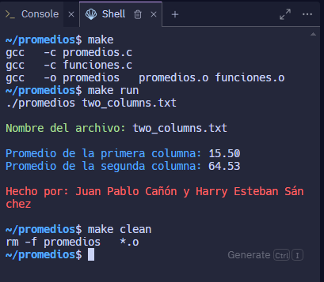

# Taller de Promedio de Columnas
---
Este es un programa en lenguaje C que lee un archivo de texto `two_columns.txt` con dos columnas de números enteros. El programa suma los números en cada columna y calcula el promedio, mostrando los resultados en la consola.
---
## Estructura del código

El código incluye los siguientes archivos:

1. **promedios.c:** El archivo principal que lee el archivo de texto, realiza la suma de las dos columnas y muestra los resultados.

2. **funciones.c:** Contiene la función `calcular_promedio` que toma la suma de una columna y la cantidad de elementos, calculando y retornando el promedio.

3. **funciones.h:** Define la función `calcular_promedio` para `funciones.c`.

4. **Makefile:** Archivo para gestionar la compilación, ejecución y limpieza del proyecto.

5. **two_columns.txt:** Archivo de texto con dos columnas de números enteros, utilizado para la entrada del programa.

## Cómo Compilar y Ejecutar

1. **Compilar:** Para compilar el proyecto, abre una terminal en el directorio raíz del proyecto y ejecuta:

$ make
$ make run
$ make clean

---

